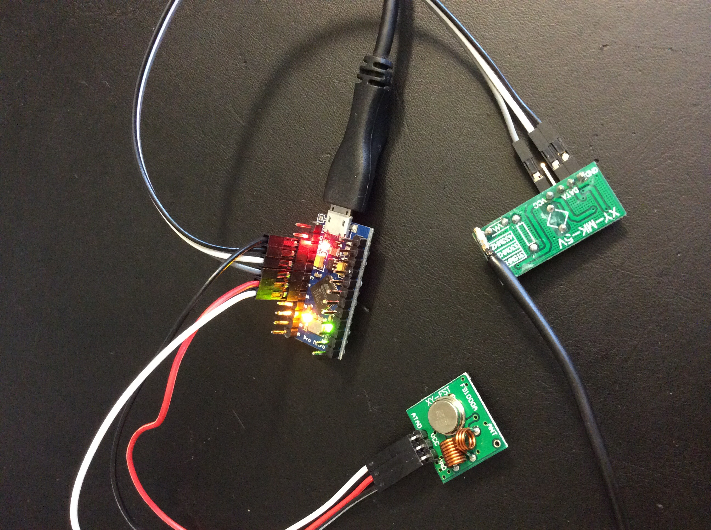

Radio
=====
A cross-platform and cross-radio c library for transmitting and receiving raw
data using radio modules.

Currently there's implemented functionality only for arduino and for those cheap radio modules
found on ebay with separate transmitter and receiver (cost of both about $1).

How to add a new radio module
======
* Create radio_<type>.h and radio_<type>.c similar to radio.h and radio.c
* Create a function named radio_<type>_send that's similar to radio_send.
* Create radio_<type>_<platform>.h for each platform similar to radio_arduino.h

How to add a new platform
======
* Create <platform>.h for platform specific functions.
* Create radio_<type_<platform>.h and .c for each radio module.

Example
======
Platform: Arduino Pro Micro
Radio: cheap transmitter and receiver from ebay

This example will turn on and off a philips remote controlled power outlet.
While in serial terminal press 1 to switch power on and 2 to switch power off.
All external radio transmission are printed to the serial terminal.



```c++
#include <avr/wdt.h>
#include "radio_arduino.h"

Radio * radio = NULL;
uint8_t lights_on[] = {0xc0, 0xff, 0xf0};
uint8_t lights_off[] = {0xc0, 0xff, 0x00};

#define PIN0 INT3
#define PIN1 INT2
#define PIN2 INT1
#define PIN3 INT0

void callback_receive(struct Radio * radio, uint8_t * content,
                      size_t content_size)
{
	int i;

	for(i = 0; i < content_size; i++) {
		Serial.print(content[i], HEX);

		if(i + 1 < content_size)
			Serial.print(" ");
	}

	Serial.println("");
}

void setup()
{
	Serial.begin(9600);

	while(!Serial);

	wdt_enable(WDTO_1S);
	radio_create_arduino<radio, 4, 5, 3, PIN2>();

	if(radio) {
		radio->transmit_repeat = 9;
		radio->callback_receive = callback_receive;
		Serial.println("Radio active and ready to engage.");
		radio->receiver_power(1);
	}
}

void loop()
{
	wdt_reset();

	if(radio) {
		if(Serial.available()) {
			char c = Serial.read();

			switch(c) {
			case '1':
				radio_send(radio, lights_on, sizeof(lights_on));
				break;

			case '2':
				radio_send(radio, lights_off, sizeof(lights_off));
				break;
			}

			while(Serial.available())
				Serial.read();
		}
	}
}
```
